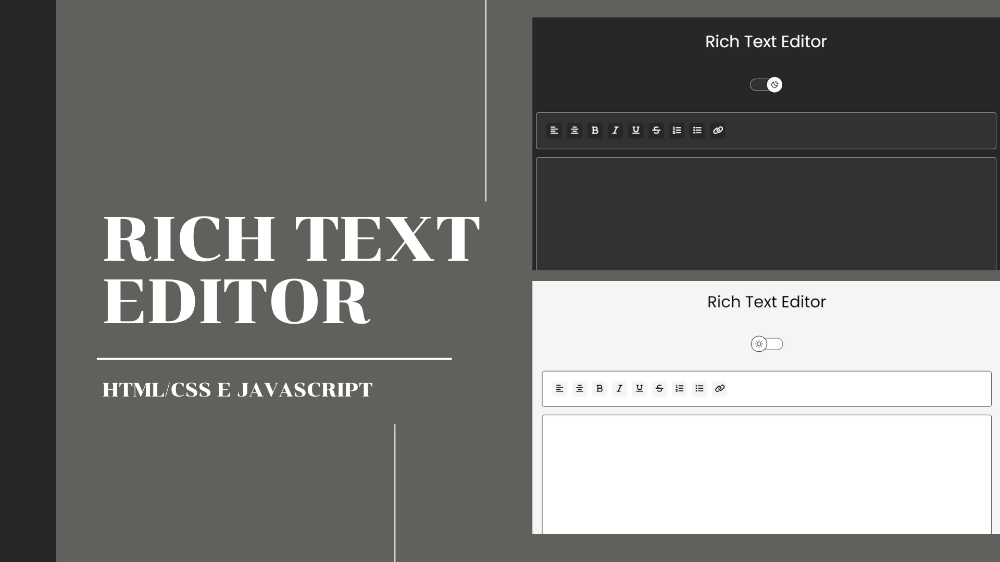

 

## 🖥️ Projeto

Este é um projeto simples de um editor de Rich Text que inclui um recurso de alternância de tema, permitindo aos usuários mudar entre modos claro e escuro. O projeto utiliza HTML, CSS e JavaScript para fornecer uma interface de edição rica e interativa com suporte a temas.

## 🚀 Funcionalidades

- **Editor de Rich Text**: Permite a formatação de texto com negrito, itálico, sublinhado e outras opções de formatação.
- **Alternância de Tema**: Muda entre os modos claro e escuro com um simples interruptor.

### 🔎 Tecnologias

Esse projeto foi desenvolvido com as seguintes tecnologias:

- HTML e CSS
- JavaScript
- Git e Github